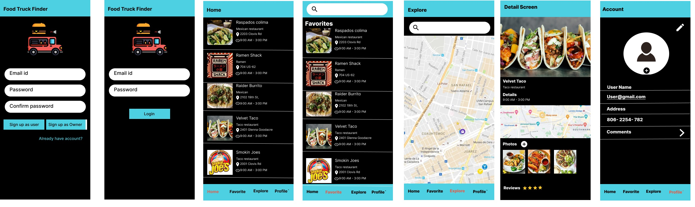
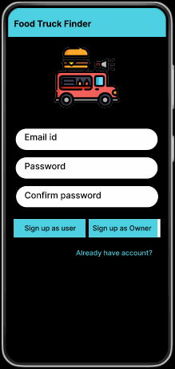

# Food-Truck-Tracker

## Table of Contents

1. Overview
2. Product Spec
3. Wireframes

## Overview

### Description
Tracks the food trucks around the user. Updated the current location of all food trucks in certain areas. It also recommends for food truck lovers or tourists the most popular ones. It also helps food truck owners update their current location and advertise themselves with their best food. 

### App Evaluation

* Category: Social media app / Food
* Mobile: This app would be primarily developed for mobile but would perhaps be just as viable on a computer. Functionality wouldn't be limited to mobile devices, however, the mobile version could potentially have more features.
* Story: Tracking the location of food trucks around the user’s location. The food trucks can update their current location to advertise themselves. The user can track their favorite food truck's whereabouts through the app, and discover new/ popular food trucks.
* Market: Any individual could choose to use this app, especially food lovers. The truck owners also use the app to update their current location and food items to its customer. The potential user could be the street sellers who are constantly on the move.
* Habit: This app could be used as often or unoften as the user wanted to depending on how often they go eat or look up food trucks.
* Scope: First we would focus on people who love food trucks and the food truck owners.  Then perhaps this could evolve into a food sharing application as it expends not only to a food truck but small sellers who don’t have a fixed location. 

## Product Spec
---

### 1. User Stories (Required and Optional)

Required Must-have Stories
  * User logs in to access app and preference settings
  * User picks some of their favorite food trucks. 
  * User will be assigned a role:  business owner, registered user, or guest.
  * Home page for different roles
  * Timeline page for registered users and guest
  * Settings (Accessibility, Notification, General, etc.)
  * 
Optional Nice-to-have Stories
  * Check-in for the registered users at the food truck 
  * Page of most popular food trucks
  * Detail of a food truck
  * Add friends and sharing option

### 2. Screen Archetypes
* Login 
* Register - User signs up or logs into their account
   * Upon Download/Reopening of the application, the user is prompted to log in to gain access to their profile information to be properly matched with another person. 
   * User need to create a role when registering
* Food truck list
    * Show list of food trucks that user can browse, see details and save as their favorites
    * Can be sorted in different ways (nearest, high rated, etc)
* Detail screen
    * Show details about selected food truck service like name, photos, contact information, locations with map data, reviews.
    * User can upload photos, give reviews by stars or comments.
    * User can share information with friends in contacts or social networks
* Map screen
    * Show trucks GPS location on map.
    * Can display selected food truck or all user’s favorite ones
* Favorites
    * Show list of user’s favorite food truck
* Settings
    * Access to settings like notifications, logging out
    
### 3. Navigation
**Tab Navigation** (Tab to Screen)
* Home
* Favorite
* Explore
* Profile

Optional:
* Cart

**Flow Navigation** (Screen to Screen)
* Forced Log-in -> Account creation if no log in is available
* Home -> Default screen after successful login.  It comprises of a recyclerview of food truck lists.
* Profile -> Jumps to account details screen
* Explore -> Jumps to map screen consists of map showing near by food trucks 
* Favorite -> Jumps to favorites screen consists of favorite food trucks.
* Cart -> Food order information is displayed on a screen

## Wireframes

.png?raw=true)

### [BONUS] Digital Wireframes & Mockups

### [BONUS] Interactive Prototype

## Schema 
### Models
#### Post
   | Property      | Type     | Description |
   | ------------- | -------- | ------------|
   | objectId      | String   | unique id for the user post (default field)    |
   | author        | Pointer to User| image author |
   | image         | File     | image that user posts |
   | description       | String   | information about food truck service |
   | reviewsCount | Number   | number of reviews recieived from users |
   | starReviewsCount    | Number   | number of reviews in stars received from users |
   | createdAt     | DateTime | date when post is created (default field) |
   | updatedAt     | DateTime | date when post is last updated (default field) |
   | reviews | Array of Reviews  | reviews received from other users |
#### User
   | Property      | Type     | Description |
   | ------------- | -------- | ------------|
   | objectId      | String   | unique id for the user (default field) |
   | email        | String | user's email |
   | username        | String | user's username |
   | bio        | String | user's profile bio |
   | profilePic         | File     | image for user's profile picture |
   | password       | String   | user's password |
   | createdAt     | DateTime | date when user is created (default field) |
   | updatedAt     | DateTime | date when user is last updated (default field) |
#### Review
   | Property      | Type     | Description |
   | ------------- | -------- | ------------|
   | objectId      | String   | unique id for the comment (default field) |
   | author        | Pointer to User| comment author |
   | post        | Pointer to Post| the post that the comment is on |
   | text       | String   | comment text |
   | createdAt     | DateTime | date when comment is created (default field) |
   | updatedAt     | DateTime | date when comment is last updated (default field) |

### Networking
#### List of network requests by screen
-  Home Feed Screen
    * (Read/GET) Query all posts where user is author  
    * (Create/POST) Create a new like on a post
    * (Delete) Delete existing like
    * (Create/POST) Create a new comment on a post
    * (Delete) Delete existing comment
- Create Post Screen
    * (Create/POST) Create a new post object
- Profile Screen
    * (Read/GET) Query logged in user object
    * (Update/PUT) Update user profile image

